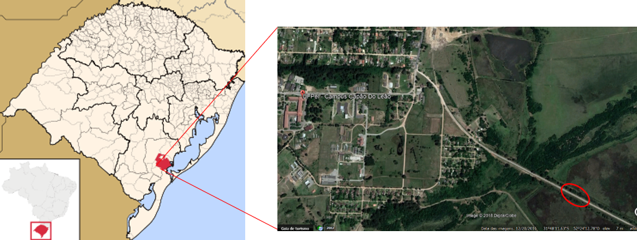

```{r setup, include=FALSE}
knitr::opts_chunk$set(echo = TRUE)
```

**Introdução**

A primeira etapa da reprodução sexuada nas angiospermas é a polinização, e a maioria das plantas nas regiões tropicais necessita de animais para a realização desse processo (OLLERTON et al., 2011). A relação entre as plantas e seus polinizadores é, em geral, mutualística, já que as espécies vegetais oferecem diversos recursos florais como néctar, pólen, óleo, perfumes aos polinizadores, enquanto que os mesmos geram um fluxo de pólen durante o forrageamento (RICKLEFS, 2010). Analisando a oferta de recursos em conjunto com os atributos da flor é possível delimitar as síndromes de polinização, que são baseadas na cor e forma dos verticilos florais, o tipo de recompensa ofertada e a ocorrência ou não de odores (SAKAI et al., 1998). 
Dicliptera squarrosa Ness é uma espécie que no Brasil é encontrada em todos os estado do sul e sudeste, além de estar presente também no Distrito Federal e Mato Gosso do Sul. Sua ocorrência é descrita, predominantemente, em locais de solo arenoso, borda de matas e matas ciliares (WASSHAUSEN & SMITH, 1969; WASSHAUSEN & WOOD, 2004).

**Objetivo**

Estre trabalho objetivou determinar o polinizador efetivo e descrever o sistema reprodutivo de Dicliptera squarrosa, no sul do Rio Grande do Sul

**Métodos**

 *Área de estudo*
 
O estudo foi realizado em uma área próxima à barragem da Eclusa (31º48’26.57”S, 52º23’48.72”O), localizada no município de Capão do Leão, Rio Grande do Sul, Brasil. O local de pesquisa está localizado aproximadamente a 2km do Campus Capão do Leão da Universidade Federal de Pelotas (UFPel) (Figura 1). 



 *Sistema de Reprodução* 
 
 Para descrever o sistema de reprodução de Dicliptera squarrosa, os seguintes tratamentos foram desenvolvidos: (A) Autopolinização espontânea – as flores em fase de pré-antese foram ensacadas e permaneceram nesse estado até o momento da análise. (B) Autopolinização manual – no momento de pré-antese, as flores foram ensacadas e posteriormente, durante a antese, ocorreu a transferência manual do pólen para o estigma da própria flor, que foi ensacada novamente. (C) Polinização cruzada – nesse tratamento as flores de um indivíduo previamente marcadas e ensacadas receberam pólen proveniente de outros indivíduos, após esse procedimento foram reensacadas. (D) Agamospermia – as flores, também em momento de pré-antese foram emasculadas, ou seja, ocorreu a retirada de suas anteras, e então foram ensacadas. (D) Tratamento Controle – as flores foram marcadas e seu desenvolvimento acompanhado sem nenhuma interferência até a formação ou não de frutos (DAFINI, 1992). Em campo, cada tratamento recebeu uma fita de identificação com cores distintas.
De acordo com o proposto por Zapata e Arroyo (1978), foi testado o Índice de Autocompatibilidade (ISI) através da divisão da média de frutos por flores no teste de Autopolinização manual, pela mesma média do teste de Polinização cruzada.

*Viabilidade de sementes*

Após terem sido contabilizadas, as sementes formadas nos tratamentos foram submetidas ao teste de viabilidade através de germinação seguindo a metodologia adaptada de Lima e Vieira (2006). Estas foram depositadas em gerbox com papel filtro umedecido com água destilada e foram armazenadas em B.O.D. à temperatura de 25º C e 12 horas de luz no Laboratóro de Fisiologia de Sementes no Departamento de Botânica da UFPel. Foram consideradas viáveis as sementes que tiveram a protusão da raiz primária. 

**Resultados**

*Sistema de Reprodução*
A floração teve início na segunda quinzena do mês de novembro, com poucos indivíduos floridos no local de estudo e, após cerca de 25 dias, a maioria das flores já estavam em antese. Supõem-se que a época de floração no local de estudo estava atrasada, pois grupos localizados na cidade de Pelotas, no mesmo período, já possuíam flores. 
Os cinco tratamentos realizados formaram frutos, sendo, o Controle, o tratamento que formou o maior número de frutos (Tabela 1). Alguns frutos formados nos tratamentos Controle e Polinização cruzada, não possuíam sementes, porém os frutos não apresentavam nenhum orifício, podendo a ausência de sementes ser atribuída ao aborto das mesmas. Alguns frutos apresentaram um número menor de sementes do que o esperado, o que pode ser atribuído a não fecundação do óvulo.
Na tabela 1 é possível observar as taxas de frutificação de todos os tratamentos realizados.O Teste Exato de Fischer foi utilizado como alternativa para analisar os dados, não sendo observado uma diferença significativa (p = 0,056), ou seja, a formação de fruto independe do tipo de tratamento realizado, podendo a planta produzir furtos através de qualquer tipo de cruzamento. 
Também é observado na tabela 1 que o tratamento Controle obteve maior frutificação do que os outros realizados, sendo que resultados semelhantes foram observados por Matias e Consolaro (2014), Silva e Nogueira (2012), Lima e Vieira (2006) e Buzzato (1990). Esse sucesso na polinização aberta pode estar relacionado a ocorrência mútua da transferência de pólen através do polinizador e autopolinização (SILVA, C.A.; NOGUEIRA, G.A, 2012), fortalecendo a ideia do sistema de reprodução misto, o qual pode ser uma boa estratégia para manutenção da população em caso de ausência de polinizadores, ou em ambientes perturbados. 

```{r echo= F}
sistcruz <- read.table("../data/sistemacruzamento.txt", header = T)
library(DT)
datatable(sistcruz)
```


