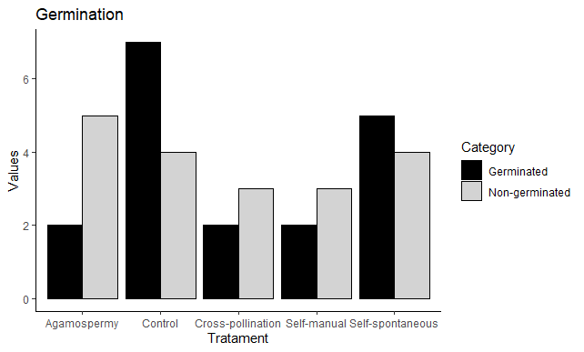

```{r setup, include=FALSE}
knitr::opts_chunk$set(echo = TRUE)
```

**Introdução**

A primeira etapa da reprodução sexuada nas angiospermas é a polinização, e a maioria das plantas nas regiões tropicais necessita de animais para a realização desse processo [@Ollerton2011]. A relação entre as plantas e seus polinizadores é, em geral, mutualística, já que as espécies vegetais oferecem diversos recursos florais como néctar, pólen, óleo, perfumes aos polinizadores, enquanto que os mesmos geram um fluxo de pólen durante o forrageamento (Rickfles, 2010). Analisando a oferta de recursos em conjunto com os atributos da flor é possível delimitar as síndromes de polinização, que são baseadas na cor e forma dos verticilos florais, o tipo de recompensa ofertada e a ocorrência ou não de odores [@Ollerton2007]. 
Dicliptera squarrosa Ness é uma espécie que no Brasil é encontrada em todos os estado do sul e sudeste, além de estar presente também no Distrito Federal e Mato Gosso do Sul. Sua ocorrência é descrita, predominantemente, em locais de solo arenoso, borda de matas e matas ciliares [@Wasshausen2004].

**Objetivo**

Estre trabalho objetivou determinar o polinizador efetivo e descrever o sistema reprodutivo de Dicliptera squarrosa, no sul do Rio Grande do Sul

**Métodos**

 *Área de estudo*
 
O estudo foi realizado em uma área próxima à barragem da Eclusa (31º48’26.57”S, 52º23’48.72”O), localizada no município de Capão do Leão, Rio Grande do Sul, Brasil. O local de pesquisa está localizado aproximadamente a 2km do Campus Capão do Leão da Universidade Federal de Pelotas (UFPel) (Figura 1). 


Figura 1 - Localização do município de Capão do Leão no mapa do Rio Grande do Sul e foto da região contendo em destaque a área de próxima a Barragem da Eclusa.

 *Sistema de Reprodução* 
 
 Para descrever o sistema de reprodução de Dicliptera squarrosa, os seguintes tratamentos foram desenvolvidos: (A) Autopolinização espontânea – as flores em fase de pré-antese foram ensacadas e permaneceram nesse estado até o momento da análise. (B) Autopolinização manual – no momento de pré-antese, as flores foram ensacadas e posteriormente, durante a antese, ocorreu a transferência manual do pólen para o estigma da própria flor, que foi ensacada novamente. (C) Polinização cruzada – nesse tratamento as flores de um indivíduo previamente marcadas e ensacadas receberam pólen proveniente de outros indivíduos, após esse procedimento foram reensacadas. (D) Agamospermia – as flores, também em momento de pré-antese foram emasculadas, ou seja, ocorreu a retirada de suas anteras, e então foram ensacadas. (D) Tratamento Controle – as flores foram marcadas e seu desenvolvimento acompanhado sem nenhuma interferência até a formação ou não de frutos (Dafini, 2005). Em campo, cada tratamento recebeu uma fita de identificação com cores distintas.
De acordo com o proposto por @Zapata1978, foi testado o Índice de Autocompatibilidade (ISI) através da divisão da média de frutos por flores no teste de Autopolinização manual, pela mesma média do teste de Polinização cruzada.

*Viabilidade de sementes*

Após terem sido contabilizadas, as sementes formadas nos tratamentos foram submetidas ao teste de viabilidade através de germinação seguindo a metodologia adaptada de @Lima2006. Estas foram depositadas em gerbox com papel filtro umedecido com água destilada e foram armazenadas em B.O.D. à temperatura de 25º C e 12 horas de luz no Laboratóro de Fisiologia de Sementes no Departamento de Botânica da UFPel. Foram consideradas viáveis as sementes que tiveram a protusão da raiz primária. 

**Resultados**

*Sistema de Reprodução*
A floração teve início na segunda quinzena do mês de novembro, com poucos indivíduos floridos no local de estudo e, após cerca de 25 dias, a maioria das flores já estavam em antese. Supõem-se que a época de floração no local de estudo estava atrasada, pois grupos localizados na cidade de Pelotas, no mesmo período, já possuíam flores. 
Os cinco tratamentos realizados formaram frutos, sendo, o Controle, o tratamento que formou o maior número de frutos (Tabela 1). Alguns frutos formados nos tratamentos Controle e Polinização cruzada, não possuíam sementes, porém os frutos não apresentavam nenhum orifício, podendo a ausência de sementes ser atribuída ao aborto das mesmas. Alguns frutos apresentaram um número menor de sementes do que o esperado, o que pode ser atribuído a não fecundação do óvulo.
Na tabela 1 é possível observar as taxas de frutificação de todos os tratamentos realizados.O Teste Exato de Fischer foi utilizado como alternativa para analisar os dados, não sendo observado uma diferença significativa (p = 0,056), ou seja, a formação de fruto independe do tipo de tratamento realizado, podendo a planta produzir furtos através de qualquer tipo de cruzamento. 
Também é observado na tabela 1 que o tratamento Controle obteve maior frutificação do que os outros realizados, sendo que resultados semelhantes foram observados por @Matias2014, @Lima2006 e @Buzzato1990. Esse sucesso na polinização aberta pode estar relacionado a ocorrência mútua da transferência de pólen através do polinizador e autopolinização, fortalecendo a ideia do sistema de reprodução misto, o qual pode ser uma boa estratégia para manutenção da população em caso de ausência de polinizadores, ou em ambientes perturbados[@Potts2010]. 

Tabela 1 - Número de frutificações nos diferentes tratamentos do sistema reprodutivo de Dicliptera squarrosa Ness e suas respectivas taxas de frutificação.
```{r echo= F}
sistcruz <- read.table("../data/sistemacruzamento.txt", header = T)
library(DT)
datatable(sistcruz)
```
Segundo Silva e Nogueira (2012), Lepidagathis sessilifolia (Pohl) Kameyama ex Wassh. & J.R.I. Wood (Acanthaceae) é autocompatível e agamospérmica, com inexistência de mecanismos que dificultem a autopolinização. A receptividade do estigma e a liberação de pólen, ocorre antes da antese favorecendo a autocompatibilidade nessa espécie.
Para Ruellia angustiflora (Ness) Lindau ex Rambo (Acanthaceae) foi observado que os tratamentos que tiveram maior taxa de frutificação foram Autopolinização manual, Controle e Polinização cruzada com respectivamente 85%, 70% e 53% cada uma [@Faria2010]. Já no que diz respeito a Ruellia breviflora (Pohl) Ezcurra (Acanthaceae), @SIGRIST2002 constataram que a espécie é autocompatível, ocorrendo polinização espontânea e que para todos os tratamentos ocorreu a formação de sementes viáveis.  
@Matias2014, observaram em Geissomeria pubescens Ness (Acanthaceae) que apenas Autopolinização manual, Polinização cruzada e Controle obtiveram a formação de fruto, porém a taxa de frutificação dos dois primeiros tratamentos foram muito baixas, se aproximando de 0, e que apenas o controle teve uma frutificação melhor (26,4%). 

*Viabilidade de sementes*

Conforme anteriormente citado, em todos os tratamentos de sistema de cruzamento realizados, ocorreu a formação de semente. Para testar se essas sementes eram ou não viáveis, foi realizado um teste de germinação para cada tratamento. Todos os tratamentos possuíram sementes que germinaram, ou seja, emitiram a radícula (Figura 3).
Observando o gráfico da figura 2 é possível perceber que ambos os tratamentos de Autopolinização e o de Agamospermia, não apresentaram germinação para a maioria das sementes obtidas, sendo que apenas duas sementes em cada tratamento germinaram. Já o tratamento Controle foi o que apresentou maior número de sementes viáveis, fortalecendo a ideia de que a planta é eficiente na manutenção da sua população na natureza.
Para avaliar se a germinação difere significativamente entre os tratamentos foi utilizado o Teste exato de Fischer, o qual constatou que a germinação de sementes independe do tipo de tratamento realizado (p=0,256), o que corrobora com os testes do sistema de cruzamento pois as sementes oriundas de qualquer tratamento são viáveis para germinação. Segundo Lima e Vieira (2006) as duas espécies de Ruellia estudadas possuíram altas taxas de germinação nos tratamentos de autopolinização (83% a mais alta e 67% a mais baixa). Já Padilha (2016) constatou que para Justicia brasiliana as maiores taxas de germinação foram nos tratamentos de Polinização cruzada, sendo que o controle não apresentou a formação de plântulas. 
Diferente do que pode ser observado na planta em estudo, onde a maior taxa de germinação foi no tratamento controle (63,63%), seguido da polinização cruzada (55,5%), sugerindo a ocorrência de fluxo gênico e consequentemente descartando o efeito de endogamia na população.
Assim como o citado por @Lima2006 a maior perda de sementes, seja por não germinação ou originando plântulas anormais, foi em decorrência da contaminação por fungos. 



Figura 2 - Germinação de sementes obtidas tratamentos de sistema de cruzamento. 

**Refências**